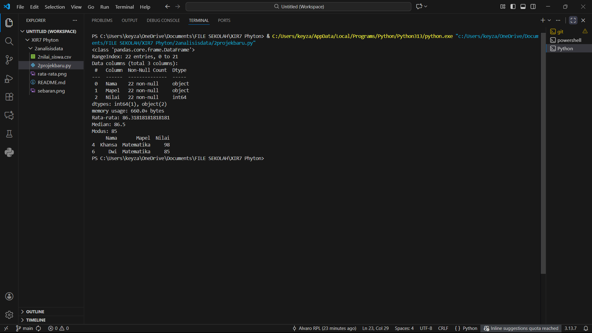

**Analisis dan Pertanyaan**
1. Mapel mana yang memiliki rata-rata nilai tertinggi?
Matematika
2. Mapel mana yang memiliki nilai terendah?
Bahasa Inggris
3. Bagaimana visualisasi membantu dalam memahami data?
Mempermudah dalam membaca data
Refleksi Siswa

1. Apa hal baru yang kamu pelajari dari kegiatan analisis dan visualisasi data?
Python bisa mengambil data dari file lain dalam format .csv
2. Kesulitan apa yang kamu alami dalam membuat grafik?
-
3. Menurtu kamu AI apa membantu dalam analysis sebua data?
Iya, Membantu mempermudah dalam membaca data

**Hasil di terminal:**

PS C:\Users\keyza\OneDrive\Documents\FILE SEKOLAH\XIR7 Phyton> & C:/Users/keyza/AppData/Local/Programs/Python/Python313/python.exe "c:/Users/keyza/OneDrive/Documents/FILE SEKOLAH/XIR7 Phyton/2analisisdata/2projekbaru.py"
<class 'pandas.core.frame.DataFrame'>
RangeIndex: 22 entries, 0 to 21
Data columns (total 3 columns):
 #   Column  Non-Null Count  Dtype 
---  ------  --------------  ----- 
 0   Nama    22 non-null     object
 1   Mapel   22 non-null     object
 2   Nilai   22 non-null     int64 
dtypes: int64(1), object(2)
memory usage: 660.0+ bytes
Rata-rata: 86.31818181818181
Median: 86.5
Modus: 85
     Nama       Mapel  Nilai
4  Khansa  Matematika     98
6     Dwi  Matematika     85

**Hasil tabel2:**

> plt.title('Rata-Rata Nilai per Mapel')
> t.xlabel('Mata Pelajaran')
> plt.ylabel('Nilai Rata-Rata')
> plt.show()

> sns.boxplot(x='Mapel', y='Nilai', data=data)
> plt.title('Sebaran Nilai per Mata Pelajaran')
> plt.show()