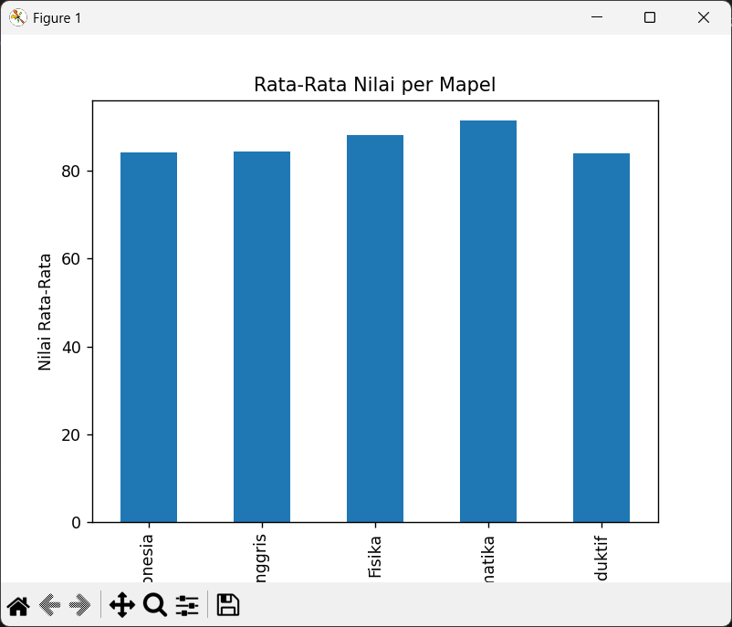
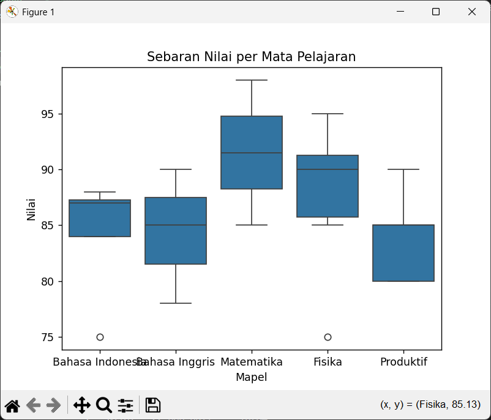

**Hasil di terminal:**

PS C:\Users\keyza\OneDrive\Documents\FILE SEKOLAH\XIR7 Phyton> & C:/Users/keyza/AppData/Local/Programs/Python/Python313/python.exe "c:/Users/keyza/OneDrive/Documents/FILE SEKOLAH/XIR7 Phyton/2analisisdata/2projekbaru.py"
<class 'pandas.core.frame.DataFrame'>
RangeIndex: 22 entries, 0 to 21
Data columns (total 3 columns):
 #   Column  Non-Null Count  Dtype 
---  ------  --------------  ----- 
 0   Nama    22 non-null     object
 1   Mapel   22 non-null     object
 2   Nilai   22 non-null     int64 
dtypes: int64(1), object(2)
memory usage: 660.0+ bytes
Rata-rata: 86.31818181818181
Median: 86.5
Modus: 85
     Nama       Mapel  Nilai
4  Khansa  Matematika     98
6     Dwi  Matematika     85

**Hasil tabel2:**

